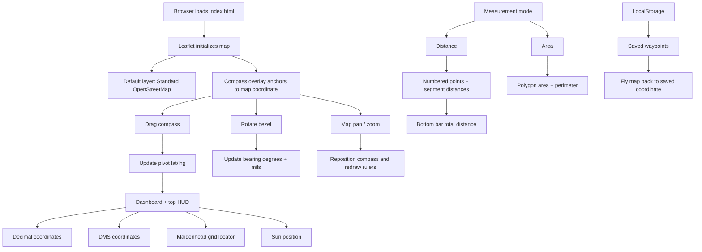
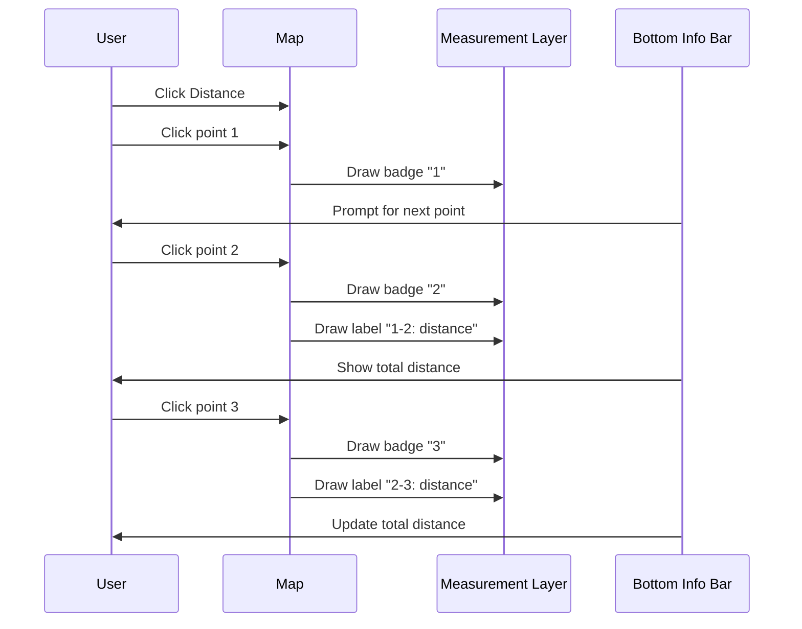

# 9M2PJU Map & Compass


A browser-based map and Silva-style compass tool for navigation practice, field planning, ham radio location work, and quick distance checks.

Built by [9M2PJU](https://hamradio.my).

## What It Does

9M2PJU Map & Compass overlays an interactive orienteering compass on top of live web maps. Drag the compass pivot to any location, rotate the bezel for bearing work, inspect coordinates, read the Maidenhead grid square, save waypoints, and measure routes or areas directly in the browser.

No install, no build step, no backend. Just open the page.

## Highlights

| Feature | Description |
| --- | --- |
| Silva-style compass | Draggable baseplate, rotatable bezel, bearing display in degrees and mils. |
| Dynamic map layers | Standard OSM by default, plus Voyager, OpenTopoMap, Esri Satellite, and Tactical Dark. |
| Light/dark map switch | Dedicated map appearance toggle independent from the UI theme. |
| Live coordinates | Decimal degrees, DMS, zoom level, and Maidenhead grid locator. |
| Maidenhead locator | Shows ham radio grid locator such as `OJ03UD` in the top HUD and dashboard. |
| Distance measurement | Numbered map points, per-segment labels, and total route distance. |
| Area measurement | Polygon area plus perimeter using geodesic calculations. |
| Dynamic rulers | Compass baseplate rulers scale with zoom and latitude. |
| Solar position | Solar azimuth, altitude, sunrise, and sunset for the compass position. |
| Waypoints | Save coordinates locally and jump back to them later. |
| Desktop and mobile | Responsive sidebar, touch-friendly controls, safe-area spacing, and mobile icon toolbar. |

## How It Works



## Measurement Workflow



## Controls

| Control | Action |
| --- | --- |
| Drag compass body | Move the compass pivot over a map location. |
| Drag pink rotate handle | Rotate the compass bezel / bearing. |
| Double tap rotate handle | Reset compass rotation and recenter it. |
| Mouse wheel over compass | Scale compass size on desktop. |
| Pinch over compass | Scale compass size on touch devices. |
| Distance | Create a measured route with numbered points. |
| Area | Create a measured polygon with area and perimeter. |
| Undo | Remove the most recent measurement point. |
| Clear | Remove all measurements. |
| Reset North | Return the compass bearing to north. |
| Zoom Fit | Fit measurements, or center the map on the compass position. |
| Locate | Ask the browser for current location access. |

## Map Layers

The app starts with **Standard OpenStreetMap** for maximum familiarity and readability.

Available map layers:

- Standard OpenStreetMap
- Carto Voyager road map
- OpenTopoMap topographic map
- Esri Satellite imagery
- Carto Tactical Dark

The **Map Appearance** switch in the Themes panel quickly toggles between Standard OSM and Tactical Dark.

## Maidenhead Grid Locator

The app calculates a 6-character Maidenhead grid locator from the compass pivot coordinate.

Example:

```text
Latitude:  3.12869
Longitude: 101.68688
Grid:      OJ03UD
```

This is useful for amateur radio operators who need quick grid square references while browsing or planning from a map.

## Browser Compatibility

Tested with modern desktop and mobile browser behavior in mind:

- Responsive layout for desktop and phone viewports
- Touch-friendly 44px controls
- Mobile-safe viewport height with `100dvh`
- Safe-area support for phones with notches
- Reduced-motion support
- Backdrop-filter fallback for browsers without glass blur support
- Deferred scripts and preconnect hints for faster startup

Recommended browsers:

- Chrome / Chromium
- Edge
- Firefox
- Safari on iOS/macOS

## Project Structure

```text
.
├── index.html   # App shell, SVG compass, controls, sidebar
├── style.css    # Responsive layout, themes, compass and measurement styling
├── app.js       # Map setup, compass logic, measurements, waypoints, grid locator
├── CNAME        # Custom domain configuration
└── README.md    # Project documentation
```

## Credits

- Maps powered by [Leaflet](https://leafletjs.com/)
- Map data by [OpenStreetMap](https://www.openstreetmap.org/)
- Solar calculations by [SunCalc](https://github.com/mourner/suncalc)
- Icons by [Lucide](https://lucide.dev/)
- Made by [9M2PJU](https://hamradio.my)
